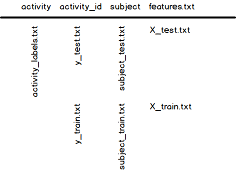

# UCI HAR Dataset Cleaner

The goal for this project is to produce a tidy and clean dataset from the data "_Human Activity Recognition Using Smartphones Data Set_" available [here](https://d396qusza40orc.cloudfront.net/getdata%2Fprojectfiles%2FUCI%20HAR%20Dataset.zip).

## What does it do?
If no directory named `./data` exists in your working directory the script downloads the zip archive and extracts it to `./data`.

### Merges the training and the test sets to create one data set

The diagram below explains how the data is stitched together:

### Extracts only the measurements on the mean and standard deviation for each measurement

The assignment doesn't list which columns to include so my interpretation of the task is to extract all the columns with names which includes the phrase `mean()` or `std()`.

To extract the data the script selects `activity`, `subject` and all the columns that matches this regexp: `\S*-(std|mean)\(\)-(X|Y|Z)` which looks for `colnames` with names that starts with any number of non-whitespace characters followed by a dash, than includes the string **std** or **mean** followed by parenthesis, then another dash then any of the characters X, Y or Z.

All the columns included is listed in the [code book](https://github.com/olkarls/UCIHARDatasetCleaner/blob/master/code_book.md).

### Uses descriptive activity names to name the activities in the data set

As explained in the diagram above the script merges the names from `activity_labels.txt` with the data from `y_test.txt` and `y_train.txt` and is converted to lower case.

### Appropriately labels the data set with descriptive variable names

To make the variable names more explainable and readable the script replaces all abbreviations with their full name in `snake_case` instead of `PascalCase`. This is the result:

|Original Name         |New More descriptive Name                       |
|----------------------|------------------------------------------------|
|activity              |activity                                        |
|subject               |subject                                         |
|tBodyAcc-mean()-X     |time_body_acceleration_mean_x                   |
|tBodyAcc-mean()-Y     |time_body_acceleration_mean_y                   |
|tBodyAcc-mean()-Z     |time_body_acceleration_mean_z                   |
|tBodyAcc-std()-X      |time_body_acceleration_standard_deviation_x     |
|tBodyAcc-std()-Y      |time_body_acceleration_standard_deviation_y     |
|tBodyAcc-std()-Z      |time_body_acceleration_standard_deviation_z     |
|tGravityAcc-mean()-X  |time_gravity_acceleration_mean_x                |
|tGravityAcc-mean()-Y  |time_gravity_acceleration_mean_y                |
|tGravityAcc-mean()-Z  |time_gravity_acceleration_mean_z                |
|tGravityAcc-std()-X   |time_gravity_acceleration_standard_deviation_x  |
|tGravityAcc-std()-Y   |time_gravity_acceleration_standard_deviation_y  |
|tGravityAcc-std()-Z   |time_gravity_acceleration_standard_deviation_z  |
|tBodyAccJerk-mean()-X |time_body_acceleration_jerk_mean_x              |
|tBodyAccJerk-mean()-Y |time_body_acceleration_jerk_mean_y              |
|tBodyAccJerk-mean()-Z |time_body_acceleration_jerk_mean_z              |
|tBodyAccJerk-std()-X  |time_body_acceleration_jerk_standard_deviation_x|
|tBodyAccJerk-std()-Y  |time_body_acceleration_jerk_standard_deviation_y|
|tBodyAccJerk-std()-Z  |time_body_acceleration_jerk_standard_deviation_z|
|tBodyGyro-mean()-X    |time_body_gyro_mean_x                           |
|tBodyGyro-mean()-Y    |time_body_gyro_mean_y                           |
|tBodyGyro-mean()-Z    |time_body_gyro_mean_z                           |
|tBodyGyro-std()-X     |time_body_gyro_standard_deviation_x             |
|tBodyGyro-std()-Y     |time_body_gyro_standard_deviation_y             |
|tBodyGyro-std()-Z     |time_body_gyro_standard_deviation_z             |
|tBodyGyroJerk-mean()-X|time_body_gyro_jerk_mean_x                      |
|tBodyGyroJerk-mean()-Y|time_body_gyro_jerk_mean_y                      |
|tBodyGyroJerk-mean()-Z|time_body_gyro_jerk_mean_z                      |
|tBodyGyroJerk-std()-X |time_body_gyro_jerk_standard_deviation_x        |
|tBodyGyroJerk-std()-Y |time_body_gyro_jerk_standard_deviation_y        |
|tBodyGyroJerk-std()-Z |time_body_gyro_jerk_standard_deviation_z        |
|fBodyAcc-mean()-X     |fft_body_acceleration_mean_x                    |
|fBodyAcc-mean()-Y     |fft_body_acceleration_mean_y                    |
|fBodyAcc-mean()-Z     |fft_body_acceleration_mean_z                    |
|fBodyAcc-std()-X      |fft_body_acceleration_standard_deviation_x      |
|fBodyAcc-std()-Y      |fft_body_acceleration_standard_deviation_y      |
|fBodyAcc-std()-Z      |fft_body_acceleration_standard_deviation_z      |
|fBodyAccJerk-mean()-X |fft_body_acceleration_jerk_mean_x               |
|fBodyAccJerk-mean()-Y |fft_body_acceleration_jerk_mean_y               |
|fBodyAccJerk-mean()-Z |fft_body_acceleration_jerk_mean_z               |
|fBodyAccJerk-std()-X  |fft_body_acceleration_jerk_standard_deviation_x |
|fBodyAccJerk-std()-Y  |fft_body_acceleration_jerk_standard_deviation_y |
|fBodyAccJerk-std()-Z  |fft_body_acceleration_jerk_standard_deviation_z |
|fBodyGyro-mean()-X    |fft_body_gyro_mean_x                            |
|fBodyGyro-mean()-Y    |fft_body_gyro_mean_y                            |
|fBodyGyro-mean()-Z    |fft_body_gyro_mean_z                            |
|fBodyGyro-std()-X     |fft_body_gyro_standard_deviation_x              |
|fBodyGyro-std()-Y     |fft_body_gyro_standard_deviation_y              |
|fBodyGyro-std()-Z     |fft_body_gyro_standard_deviation_z              |

All variable names that are used is listed in the [code book](https://github.com/olkarls/UCIHARDatasetCleaner/blob/master/code_book.md).

### Creates an independent tidy data set with the average of each variable for each activity and each subject

The script uses the library [dplyr](https://cran.rstudio.com/web/packages/dplyr/) to group and calculate the mean.

The script produces [tidy_dataset.txt](https://github.com/olkarls/UCIHARDatasetCleaner/blob/master/tidy_dataset.txt).
